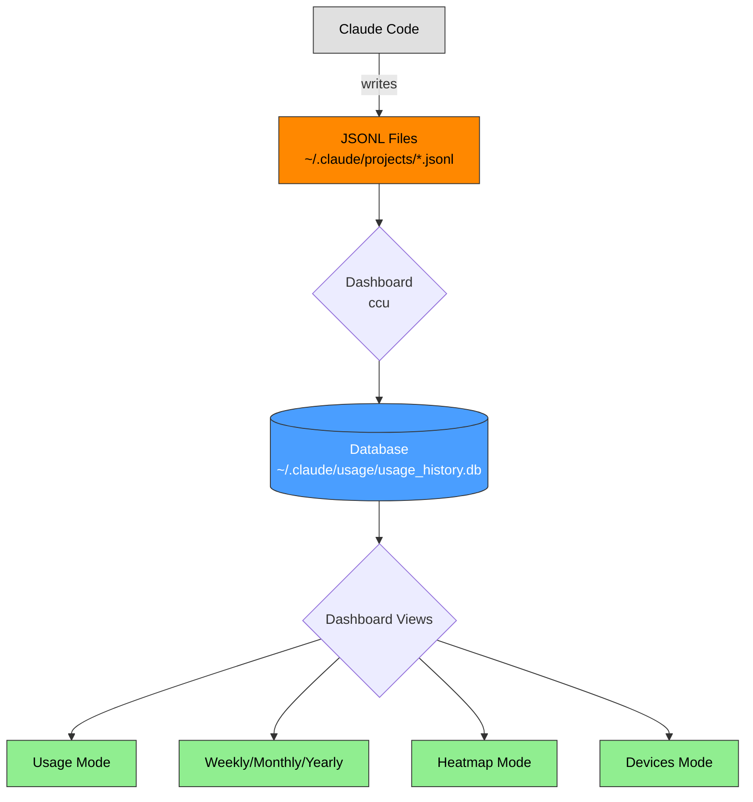

# Claude Code Goblin (Modified Fork)


> [!IMPORTANT]
> This is a **modified fork** of [claude-goblin](https://github.com/data-goblin/claude-goblin) with additional multi-PC support features and streamlined functionality.
>
> **Installation**: Run from source (see [Installation](#installation-modified-fork)) - `pip install claude-goblin` installs the original, not this fork.

Python command line tool for Claude Code usage analytics and long-term tracking with an interactive TUI dashboard.

## New Features in This Fork

- 🔄 **Automatic OneDrive Detection** - Auto-detects OneDrive across multiple drives (C:, D:, E:, F:)
- ⚙️ **Configuration Management** - `ccu config` command for database path and machine name settings
- 🖥️ **Multi-PC Support** - Track usage across multiple computers with automatic cloud sync
- 📊 **Per-Machine Statistics** - View usage breakdown by computer in devices mode
- 🌍 **Timezone Support** - Auto-detect system timezone with configurable settings
- 🎯 **Simplified & Focused** - Removed unused features (hooks, status bar, export) for cleaner codebase

**Quick Start (Modified Fork):** See [Installation](#installation-modified-fork) for running from source.

> [!NOTE]
> Both `claude-goblin` and `ccu` work interchangeably as command aliases.

## Example Outputs

**TUI Dashboard:**


**GitHub activity-style heatmap:**


---

## Features

- 📊 **Interactive Dashboard** - Real-time usage visualization with keyboard shortcuts
- 📈 **Multiple View Modes** - Usage, Weekly, Monthly, Yearly, Heatmap, Devices
- 💾 **Local Data Snapshotting** - Preserve Claude Code logs beyond 30-day limit
- 🔄 **File Watching** - Auto-update dashboard when Claude Code creates new logs
- 📅 **Historical Tracking** - Indefinite data preservation in SQLite database
- 🌐 **Multi-PC Sync** - Automatic OneDrive/iCloud Drive detection and sync
- 🏷️ **Project Anonymization** - Anonymize project names for sharing screenshots
- ⚙️ **Configurable Settings** - Timezone, backup retention, color modes

## Installation (Modified Fork)

> [!WARNING]
> This fork is not yet published to PyPI. `pip install claude-goblin` installs the **original** version, not this fork!

### Option 1: Run from Source (Recommended)

```bash
# Navigate to the fork directory
cd /path/to/claude-goblin-mod

# Install dependencies only
pip install rich typer watchdog

# Run commands directly
python3 -m src.cli --help
python3 -m src.cli  # Show dashboard
```

### Option 2: Local Editable Install

```bash
cd /path/to/claude-goblin-mod

# Install in editable mode (creates ccu command)
pip install -e .

# Now you can use ccu commands
ccu --help
ccu  # Show dashboard
```

### Option 3: Create Shell Alias

Add to `~/.bashrc` or `~/.zshrc`:
```bash
alias ccu='python3 -m src.cli'
```

Reload and use:
```bash
source ~/.bashrc
ccu --help
```

## First-Time Setup

After installation, start tracking your Claude Code usage:

```bash
# View your current usage dashboard
ccu

# The dashboard automatically saves data to the historical database
```

**Note**: The dashboard automatically saves your data to the historical database every time you run it. No manual setup required.

## Commands

| Command | Description |
|---------|-------------|
| **Dashboard & Visualization** | |
| `ccu` | Show interactive usage dashboard (default) |
| `ccu --refresh=N` | Auto-refresh every N seconds (default: file watching) |
| `ccu --anon` | Anonymize project names (project-001, project-002, etc.) |
| `ccu --watch-interval=N` | File watch check interval in seconds (default: 60) |
| `ccu --limits-interval=N` | Usage limits update interval in seconds (default: 60) |
| `ccu heatmap` | Show GitHub-style activity heatmap in terminal |
| `ccu heatmap --year 2024` | Show heatmap for specific year |
| **Configuration** | |
| `ccu config show` | Display all configuration settings |
| `ccu config set-db-path <path>` | Set custom database path (e.g., OneDrive) |
| `ccu config clear-db-path` | Clear custom path (use auto-detect) |
| `ccu config set-machine-name <name>` | Set friendly machine name |
| `ccu config clear-machine-name` | Clear custom name (use hostname) |
| `ccu settings` | Interactive settings menu (timezone, backups, colors) |
| **Database Management** | |
| `ccu reset-db --force` | Reset database (delete and start fresh) |
| `ccu init-db --force` | Initialize/reset database (alias for reset-db) |

### Interactive Dashboard Modes

The `ccu` command provides an interactive dashboard with multiple view modes:

**Keyboard Shortcuts:**
- `u` - Usage mode (current week usage limits with reset dates and costs)
- `w` - Weekly mode (current week statistics, daily breakdown with drill-down)
- `m` - Monthly mode (current month statistics, project breakdown, daily breakdown)
- `y` - Yearly mode (current year statistics, project breakdown, monthly breakdown)
- `h` - Heatmap mode (GitHub-style activity heatmap)
- `d` - Devices mode (per-machine statistics)
- `1-7` - View detailed hourly breakdown for specific day (in weekly mode)
- `<` / `>` - Navigate previous/next period (weekly/monthly/yearly modes)
- `tab` - Change display mode (color scheme and layout)
- `r` - Manual refresh (update data immediately)
- `s` - Settings menu
- `q` / `Esc` - Quit

**Features:**
- **Real-time file watching** - Dashboard updates automatically when Claude Code creates new logs (default)
- **Periodic refresh mode** - Use `--refresh=N` to update every N seconds instead
- **Weekly date filtering** - Automatically filters data to current week limit period
- **Background limits updater** - Updates usage limits every 60 seconds in a background thread
- **Device tracking** - Shows usage breakdown by machine name (hostname or custom name)
- **Hourly drill-down** - Press number keys (1-7) in weekly view to see hourly details

## Data Source

Claude Goblin reads usage data from Claude Code's local session logs:
```
~/.claude/projects/*.jsonl
```

**Important**: Claude Code retains session logs for approximately **30 days** (rolling window). Claude Goblin solves this by:
- Automatically saving data to an SQLite database (`~/.claude/usage/usage_history.db`)
- Preserving historical data indefinitely
- Merging current + historical data for complete analytics

## How It Works



**Key Points:**
- **JSONL files** are raw logs with a 30-day rolling window (older data disappears)
- **Dashboard** reads JSONL and saves to DB (with automatic deduplication)
- **Database** is the single source of truth - all displays read from here
- **Multi-view dashboard** provides different perspectives on the same data

### File Locations

| File | Location | Purpose |
|------|----------|---------|
| **JSONL logs** | `~/.claude/projects/*.jsonl` | Current 30-day usage data from Claude Code |
| **SQLite DB** | `~/.claude/usage/usage_history.db` (default) | Historical usage data preserved indefinitely |
| **SQLite DB** | `/mnt/d/OneDrive/.claude-goblin/usage_history.db` (auto-detected) | OneDrive sync location (if available) |
| **Config** | `~/.claude/goblin_config.json` | User configuration settings |

## Multi-PC Setup (Fork Feature)

This fork automatically detects OneDrive and enables multi-PC synchronization.

### Automatic Setup (Zero Configuration)

```bash
# On PC-A (Desktop)
ccu
# → Auto-detects: /mnt/d/OneDrive/.claude-goblin/usage_history.db
# → OneDrive automatically syncs to cloud

# On PC-B (Laptop)
ccu
# → Auto-detects same OneDrive path
# → Automatically uses synced database
# ✅ Your usage from both PCs is now combined!
```

### Manual Configuration

If OneDrive is in a non-standard location:

```bash
# Check current settings
ccu config show

# Set custom OneDrive path
ccu config set-db-path /mnt/e/MyOneDrive/.claude-goblin/usage_history.db

# Set friendly machine name
ccu config set-machine-name "Home-Desktop"
```

### Supported Cloud Storage

- ✅ **OneDrive** (Windows/WSL2) - Auto-detected on drives C:, D:, E:, F:
- ✅ **iCloud Drive** (macOS) - Auto-detected at `~/Library/Mobile Documents/com~apple~CloudDocs/`
- ⚙️ **Custom paths** - Any path via `ccu config set-db-path`

### How It Works

1. **Database Location Priority**:
   - Config file setting (if set manually)
   - Environment variable `CLAUDE_GOBLIN_DB_PATH`
   - OneDrive auto-detection (WSL2: `/mnt/*/OneDrive`)
   - iCloud Drive auto-detection (macOS)
   - Local fallback (`~/.claude/usage/`)

2. **Automatic Deduplication**:
   - Each record has unique `(session_id, message_uuid)`
   - SQLite UNIQUE constraint prevents duplicates
   - Multiple PCs can safely write to same database

## Project Anonymization

The `--anon` flag anonymizes project names when displaying usage data, perfect for sharing screenshots:

```bash
ccu --anon
ccu heatmap --anon
```

Projects are renamed to `project-001`, `project-002`, etc., ranked by total token usage (project-001 has the highest usage).

## What It Tracks

- **Tokens**: Input, output, cache creation, cache read (by model and project)
- **Prompts**: User prompts and assistant responses
- **Sessions**: Unique conversation threads
- **Models**: Which Claude models you've used (Sonnet, Opus, Haiku)
- **Projects**: Folders/directories where you've used Claude
- **Time**: Daily, hourly, monthly activity patterns throughout the year
- **Usage Limits**: Real-time session, weekly, and Opus limits with automatic background updates
- **Devices**: Per-machine statistics (machine name, tokens, cost, date range)
- **Costs**: Estimated API costs for each limit period (session, weekly, Opus)

It will also compute how much you would have had to pay if you used API pricing instead of a $200 Max plan.

## Technical Details

### Interactive Dashboard Implementation

The dashboard uses multiple advanced features:

**File Watching (Default Mode)**
- Uses `watchdog` library to monitor `~/.claude/projects/*.jsonl` files
- Updates dashboard automatically when Claude Code creates/modifies logs
- More efficient than polling as it only updates on actual file changes

**Periodic Refresh Mode** (`--refresh=N`)
- Updates every N seconds via polling
- Good for environments where file watching might not work reliably

**Background Threads**
- Limits updater thread: Updates usage limits at configurable interval (default: 60 seconds)
- Keyboard listener thread: Handles mode switching without blocking dashboard
- Non-blocking architecture allows instant mode switching

**Configurable Intervals**
- `--watch-interval=N`: File watch check interval in seconds (default: 60)
- `--limits-interval=N`: Usage limits update interval in seconds (default: 60)
- Example: `ccu --watch-interval=30 --limits-interval=120`

**Weekly Date Filtering**
- Parses Claude's `/usage` week reset date (e.g., "Oct 17, 10am (Asia/Seoul)")
- Filters records to current 7-day limit period
- Shows only relevant data for current week limit

**View Mode System**
- Multiple display modes with instant switching
- Time offset navigation for monthly/yearly modes (`<` / `>` keys)
- Mode-specific breakdowns (daily/hourly for weekly, project/daily for monthly, etc.)

### Timezone Handling

All timestamps in Claude Code's JSONL files are stored in **UTC**. Claude Goblin converts to your **local timezone** when grouping activity by date.

**Features:**
- Auto-detect system timezone from `/etc/timezone` (Linux/WSL)
- Configurable timezone in settings menu (setting #11)
- Support for 'auto' mode, UTC, and common IANA timezones
- Display times in local timezone throughout the dashboard

### Cache Efficiency

The token breakdown shows cache efficiency. High "Cache Read" percentages (80-90%+) mean Claude Code is effectively reusing context, which:
- Speeds up responses
- Can reduce costs on usage-based plans
- Indicates good context management

## Requirements

- Python >= 3.10
- Claude Code (for generating usage data)
- Rich >= 13.7.0 (terminal UI)
- Typer >= 0.9.0 (CLI framework)
- watchdog >= 3.0.0 (file watching for real-time dashboard updates)

## License

MIT License - see LICENSE file for details

## Contributing

Contributions welcome! Please:
1. Fork the repository
2. Create a feature branch
3. Submit a pull request

## Troubleshooting

### "No Claude Code data found"
- Ensure Claude Code is installed and you've used it at least once
- Check that `~/.claude/projects/` exists and contains `.jsonl` files

### Limits showing "Could not parse usage data"
- Run `claude` in a trusted folder first
- Claude needs folder trust to display usage limits

### Database errors
- Try resetting: `ccu reset-db --force`
- Then run: `ccu` to rebuild from current data

## Credits

**Original Project:** [claude-goblin](https://github.com/data-goblin/claude-goblin) by Kurt Buhler

Built with:
- [Rich](https://github.com/Textualize/rich) - Terminal UI framework
- [Typer](https://github.com/tiangolo/typer) - CLI framework
- [Watchdog](https://github.com/gorakhargosh/watchdog) - File system monitoring

---

## **AI Tools Disclaimer**:
This project was developed with assistance from Claude Code.
