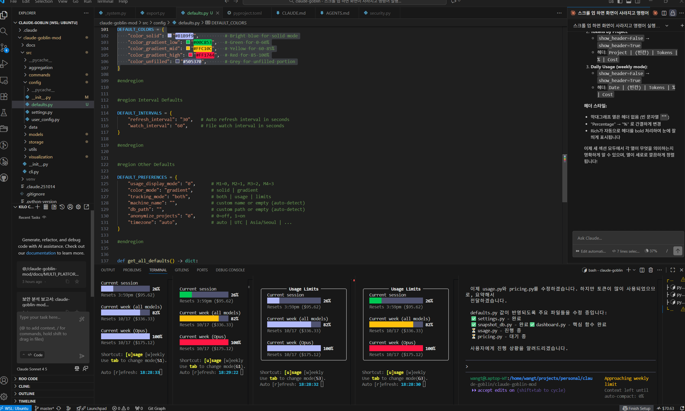
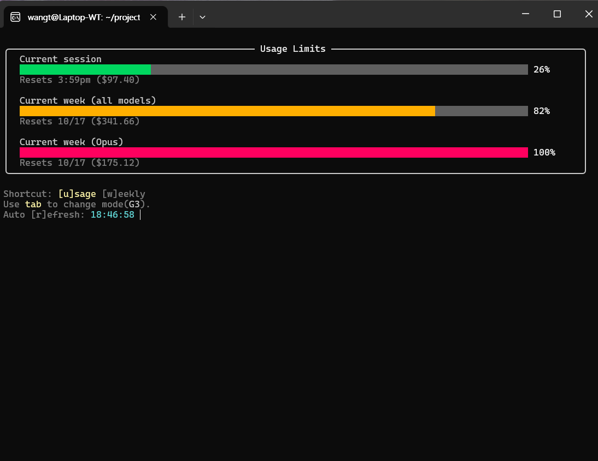
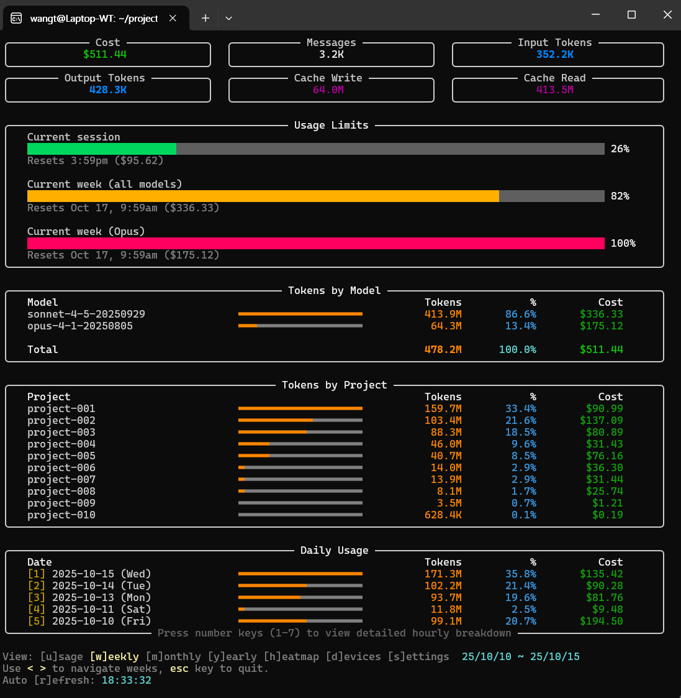
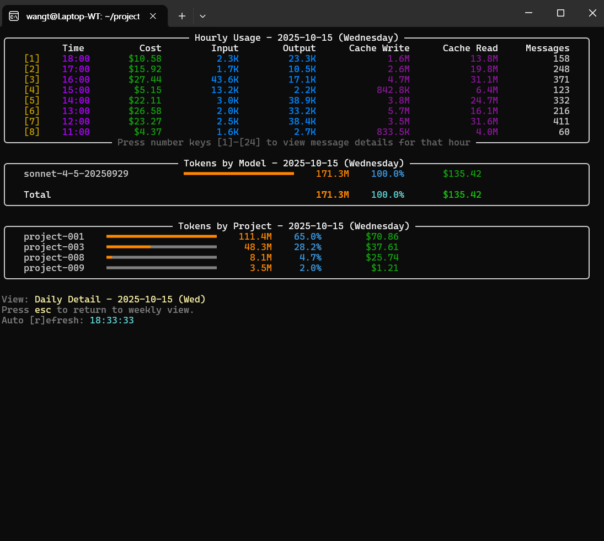
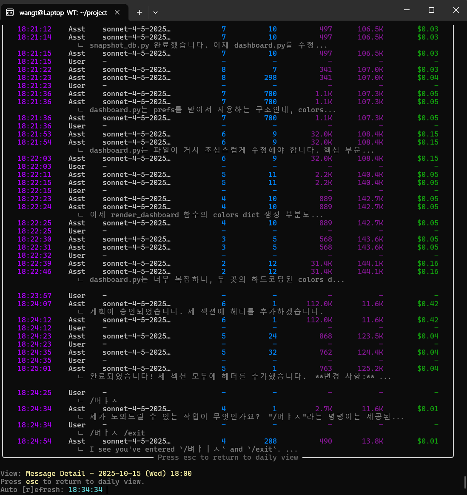
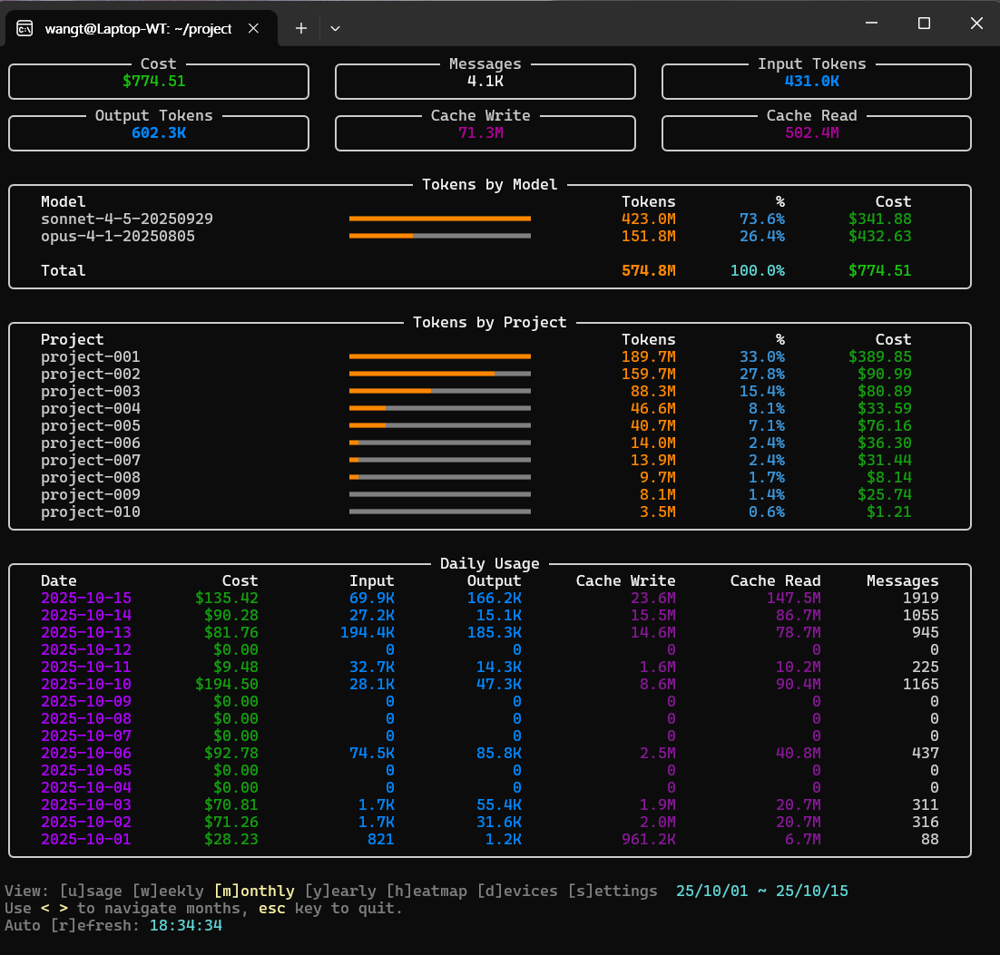
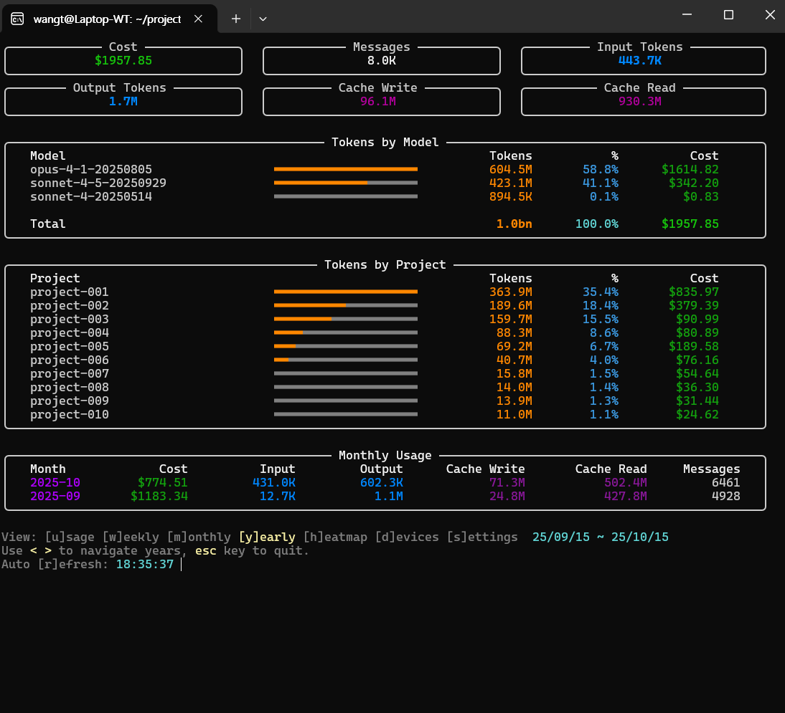
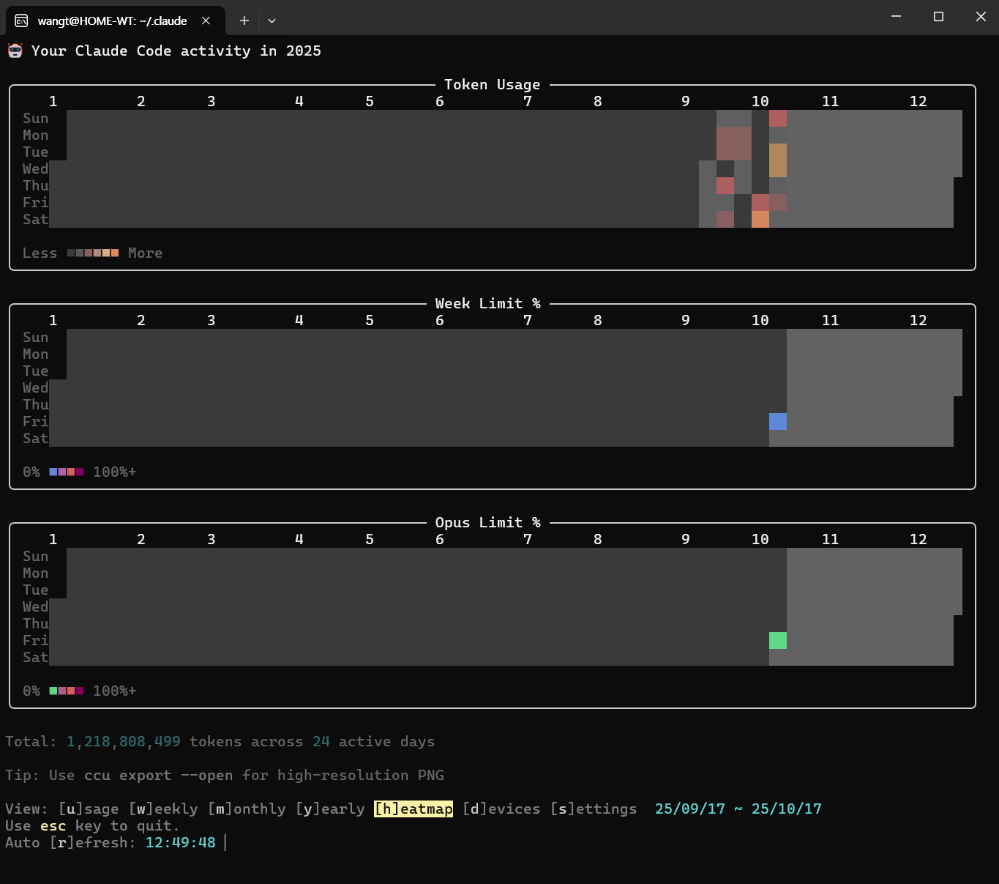
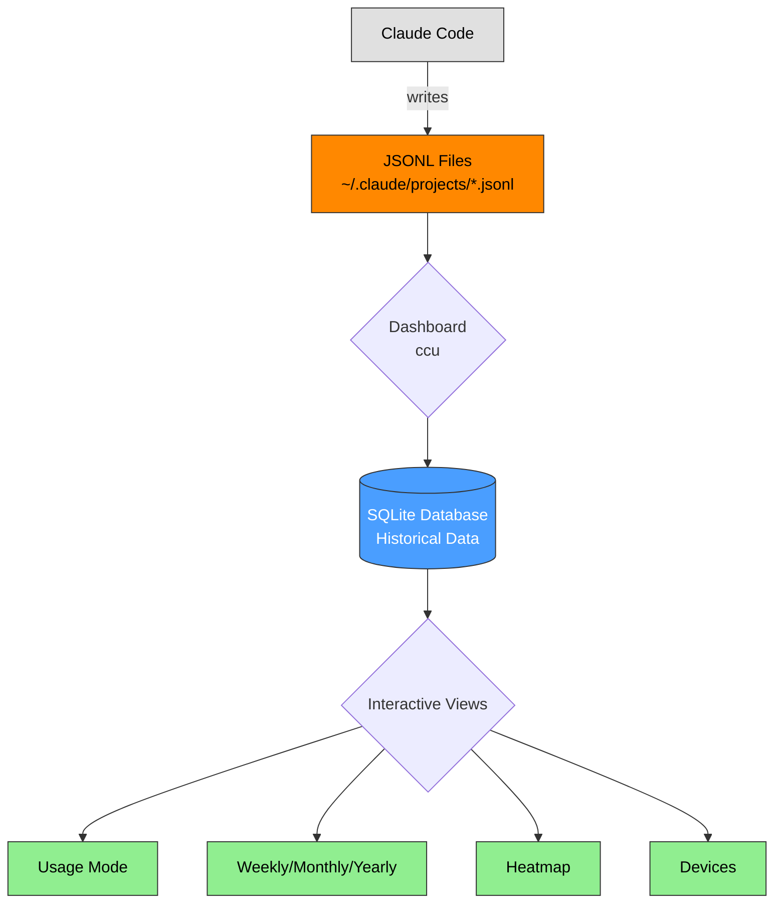

# Claude Code Goblin (Modified Fork)


> [!IMPORTANT]
> This is a **modified fork** of [claude-goblin](https://github.com/data-goblin/claude-goblin) with multi-PC support and streamlined functionality.
>
> **Installation**: Run from source (see [Installation](#installation)) - `pip install claude-goblin` installs the original, not this fork.

**Interactive TUI dashboard for Claude Code usage analytics and long-term tracking.**

Most features are accessed through keyboard shortcuts in the interactive dashboard - minimal command-line interface by design.

> [!NOTE]
> **About This Project**
>
> This tool was built as a quick utility for personal use - not as a polished, production-ready application. You may encounter bugs, rough edges, or missing features.
>
> **However**, since you're a Claude Code user, you have the perfect tool to fix any issues yourself! Think of this as a starter template that you can customize and improve with Claude Code's help.
>
> **Future Direction**: A VSCode extension would be a more robust solution than a CLI tool. This Python implementation serves as a proof-of-concept and interim solution.

---

## Features

### Core Functionality

- 📊 **Interactive Dashboard** - All features accessible via keyboard shortcuts (no complex CLI commands)
- 🔄 **Real-time Updates** - Automatic file watching when Claude Code creates new logs
- 📅 **Long-term Tracking** - Preserves usage data beyond Claude Code's 30-day limit
- 🌐 **Multi-PC Sync** - Automatic cloud storage detection for seamless multi-computer tracking (OneDrive for WSL2/Windows, iCloud Drive for macOS)
  - ⚠️ **Note**: Multi-PC sync has been tested on **WSL2 + OneDrive only**. macOS iCloud Drive support is implemented but not fully tested.
- 🖥️ **Per-Machine Stats** - Track usage breakdown across different computers

### View Modes (All In-Dashboard)

Access via keyboard shortcuts - no separate commands needed:

- **Usage Mode** (`u`) - Current week limits with reset times and cost estimates
- **Weekly View** (`w`) - Daily breakdown with hourly drill-down
- **Monthly View** (`m`) - Project and daily statistics for current month
- **Yearly View** (`y`) - Annual overview with monthly/project breakdowns
- **Heatmap** (`h`) - GitHub-style activity visualization
- **Devices** (`d`) - Per-machine usage statistics

### This Fork's Enhancements

- ✅ **Automatic Cloud Storage Detection** - OneDrive (WSL2/Windows) or iCloud Drive (macOS) with zero-config
- ✅ **Timezone Support** - Auto-detect system timezone with configurable settings
- ✅ **Streamlined Codebase** - Removed unused features (hooks, status bar, export)
- ✅ **Configuration Management** - Simple config system for database path and machine names
- ✅ **Project Anonymization** - `--anon` flag for sharing screenshots safely

---

## Screenshots

All screenshots show the interactive TUI dashboard with real-time data and keyboard navigation.

### 0. VSCode Integration - Terminal Usage



**Key Features:**
- Runs seamlessly in VSCode's integrated terminal
- Works in compact window sizes (minimal vertical space needed)
- Supports various VSCode color themes
- Full keyboard navigation without leaving the editor
- Real-time updates while coding

**Use Case:** Monitor Claude Code usage without switching applications

### 1. Usage Mode - Real-time Limits



**Key Features:**
- Current session usage (5-hour window) with reset countdown
- Weekly limit across all models with percentage bars
- Opus-specific weekly limit tracking
- Token breakdown: Input, Output, Cache Write, Cache Read
- Cost estimation and message count
- Auto-refreshes in background

**Keyboard:** `u` to switch to this view

### 2. Weekly View - Daily Breakdown



**Key Features:**
- 7-day overview with daily statistics
- Visual progress bars for each day
- Token usage by model (Sonnet/Opus breakdown)
- Top 10 projects for the week
- Press number keys `1-7` to drill down into hourly details

**Keyboard:** `w` to switch to this view

### 3. Weekly Daily Detail - Hourly Breakdown



**Key Features:**
- Hourly statistics for selected day
- Time-based token usage patterns
- Model and project breakdowns specific to that day
- Press number keys `1-24` to view individual message details
- Press `ESC` to return to weekly view

**Keyboard:** `1-7` from weekly view to select a day

### 4. Message Detail View - Individual Messages



**Key Features:**
- Individual message metadata (timestamp, model, tokens)
- Input/Output token counts with cache statistics
- Cost per message
- Content preview for each message (42 characters)
- User prompts and Assistant responses shown separately

**Keyboard:** `1-24` from daily detail view to select an hour

### 5. Monthly View - Project Focus



**Key Features:**
- Full month overview with daily bars
- Token usage trends throughout the month
- Top projects ranked by usage
- Cost and percentage breakdowns
- Navigate previous/next months with `<` and `>`

**Keyboard:** `m` to switch to this view

### 6. Yearly View - Annual Overview



**Key Features:**
- 12-month summary with monthly statistics
- Annual token usage trends
- Project rankings for the entire year
- Year-to-date cost estimation
- Navigate previous/next years with `<` and `>`

**Keyboard:** `y` to switch to this view

### 7. Heatmap View - Activity Patterns



**Key Features:**
- GitHub-style contribution graph
- Color intensity based on token usage
- Full year visualization (52 weeks)
- Identify usage patterns and trends
- Quick visual overview of activity

**Keyboard:** `h` to switch to this view

### 8. Devices View - Multi-PC Statistics


**Key Features:**
- Per-machine usage breakdown
- Device names (customizable via settings)
- Token and cost totals per device
- Date range for each device's activity
- Useful for multi-PC setups with cloud storage sync (OneDrive on WSL2/Windows, iCloud Drive on macOS)

**Keyboard:** `d` to switch to this view

### 9. Settings Menu - Configuration


**Key Features:**
- Color customization (solid colors and gradient ranges)
- Display mode preferences
- Auto-refresh interval settings
- Timezone configuration
- Backup management options
- Reset to defaults with confirmation

**Keyboard:** `s` to open settings menu from any view

---

## Installation

> [!IMPORTANT]
> This fork is installed from source, not PyPI. `pip install claude-goblin` installs the **original** version, not this fork!

### Quick Install (Recommended)

If you want to get started quickly, try these steps:

```bash
# Install pipx (if not already installed)
sudo apt install pipx       # Ubuntu/Debian
brew install pipx           # macOS

# Configure PATH
pipx ensurepath
source ~/.bashrc

# Clone and install
git clone https://github.com/wangtae/claude-goblin-mod.git
cd claude-goblin-mod
pipx install -e .

# Run from anywhere
ccu
```

> [!NOTE]
> **First-Time Setup Wizard**: On first run, an interactive setup wizard will help you choose:
> - **Database location**: OneDrive/iCloud sync (multi-device) or local storage (single device)
> - **Machine name**: Optional friendly name for this device (e.g., "Home-Desktop", "Work-Laptop")
>
> You can change these settings anytime via Settings menu (`s` in dashboard) or `ccu config` command.
>
> These quick install steps have not been fully tested across all environments. If you encounter issues, please refer to the detailed installation methods below or customize the setup using Claude Code.

### Recommended: Global Install with pipx

Install once with `pipx`, then use `ccu` from anywhere (no virtual environment needed):

```bash
# Install pipx (if not already installed)
sudo apt install pipx       # Ubuntu/Debian
brew install pipx           # macOS
pip install --user pipx     # Other systems

# Configure PATH
pipx ensurepath
source ~/.bashrc  # or restart terminal

# Clone and install
git clone https://github.com/wangtae/claude-goblin-mod.git
cd claude-goblin-mod
pipx install -e .

# Now you can use ccu anywhere
ccu  # Works from any directory!
```

**Why pipx?**
- ✅ **Isolated environment** - No dependency conflicts with other Python packages
- ✅ **Global access** - Use `ccu` from any directory without activating virtual environments
- ✅ **Editable mode** - Source code changes are immediately reflected (perfect for development)
- ✅ **Clean uninstall** - `pipx uninstall claude-goblin-mod` removes everything
- ✅ **Recommended by Python packaging community** for CLI tools

### Alternative: Local Editable Install (pip)

For systems where pipx is not available or if you prefer pip:

```bash
# Clone the repository
git clone https://github.com/wangtae/claude-goblin-mod.git
cd claude-goblin-mod

# Install in editable mode (creates ccu command)
pip install -e .

# Now you can use ccu anywhere
ccu  # Works from any directory!
```

**Note**: On some systems (Ubuntu 24.04+), you may encounter an "externally-managed-environment" error. In this case, use pipx instead (recommended) or create a virtual environment (see next section).

**If `ccu: command not found`**, add `~/.local/bin` to your PATH:
```bash
# Add to ~/.bashrc or ~/.zshrc
export PATH="$HOME/.local/bin:$PATH"
source ~/.bashrc
```

### Alternative: Virtual Environment

For completely isolated installation:

```bash
git clone https://github.com/wangtae/claude-goblin-mod.git
cd claude-goblin-mod

# Create and activate virtual environment
python3 -m venv venv
source venv/bin/activate  # Windows: venv\Scripts\activate

# Install in editable mode
pip install -e .

# Use (while venv is active)
ccu
```

### Alternative: Run from Source (No Install)

For quick testing without installation:

```bash
git clone https://github.com/wangtae/claude-goblin-mod.git
cd claude-goblin-mod

# Install dependencies only
pip install -r requirements.txt

# Run directly
python3 -m src.cli
```

---

## Usage

### Starting the Dashboard

```bash
ccu                          # Standard mode with file watching
ccu --anon                   # Anonymize project names (for screenshots)
ccu --help                   # Show help message
```

**Note**: Refresh intervals and other display settings are configured inside the program via the Settings menu (press `s` in dashboard).

### Keyboard Shortcuts (In Dashboard)

**View Modes:**
- `u` - Usage mode (current limits and costs)
- `w` - Weekly view
- `m` - Monthly view
- `y` - Yearly view
- `h` - Heatmap view
- `d` - Devices view (multi-PC stats)

**Navigation:**
- `1-7` - Hourly drill-down for specific day (weekly mode)
- `<` / `>` - Previous/next period (weekly/monthly/yearly)
- `tab` - Change display mode/color scheme
- `r` - Manual refresh
- `s` - Settings menu
- `q` / `Esc` - Quit

**Everything is accessible via these keyboard shortcuts - no need to learn complex commands!**

### Additional Commands

Only a few commands exist outside the dashboard:

```bash
# Heatmap in terminal (also accessible via 'h' in dashboard)
ccu heatmap              # Current year
ccu heatmap --year 2024  # Specific year

# Configuration
ccu config show                                   # View current configuration
ccu config set-db-path <path>                     # Set custom database path
ccu config clear-db-path                          # Use auto-detection
ccu config set-machine-name "Home-Desktop"        # Set friendly device name
ccu config clear-machine-name                     # Use system hostname

# Database management (rarely needed)
ccu reset-db --force     # Reset database
```

**Note**: Most users will only ever run `ccu` to open the dashboard. All settings (including database path and machine name) can be configured from the Settings menu (`s` key) inside the dashboard.

---

## How It Works



**Key Points:**
- **JSONL files** - Claude Code's raw logs (30-day rolling window)
- **Dashboard** - Reads JSONL and saves to SQLite (automatic deduplication)
- **Database** - Single source of truth, preserves data indefinitely
- **Interactive views** - All accessed via keyboard shortcuts in one dashboard

### Data Sources

| File | Location | Purpose |
|------|----------|---------|
| **JSONL logs** | `~/.claude/projects/*.jsonl` | Current 30-day usage from Claude Code |
| **SQLite DB** | `~/.claude/usage/usage_history.db` | Historical data (default location) |
| **SQLite DB** | `/mnt/d/OneDrive/.claude-goblin/usage_history.db` | OneDrive sync (auto-detected) |
| **Config** | `~/.claude/goblin_config.json` | User configuration |

---

## Multi-PC Synchronization

### First-Time Setup Wizard

On first run, an interactive wizard helps you choose the best database location:

```
┌─ Welcome to Claude Goblin! ─────────────────────────┐
│                                                      │
│  Choose database storage location:                  │
│                                                      │
│  [1] OneDrive/iCloud Sync (multi-device)           │
│      /mnt/d/OneDrive/.claude-goblin/usage_history.db│
│                                                      │
│  [2] Local Storage (single device)                  │
│      ~/.claude/usage/usage_history.db               │
│                                                      │
│  [3] Custom Path                                     │
│                                                      │
└──────────────────────────────────────────────────────┘
```

**Cloud Storage Auto-Detection:**
- **OneDrive** (WSL2/Windows) - Searches `/mnt/c|d|e|f/OneDrive`
- **iCloud Drive** (macOS) - Searches `~/Library/Mobile Documents/com~apple~CloudDocs`

### Multi-PC Initial Setup Tips

- Do not run the first-time wizard on multiple PCs simultaneously—conflicting OneDrive syncs can corrupt the shared database file.
- Complete setup on one machine, wait until OneDrive finishes syncing the `.claude-goblin/` database folder to every other device, and only then start installation on the next PC.

### Changing Database Location

You can change the database path anytime:

**Via Settings Menu (Recommended):**
```bash
ccu              # Open dashboard
# Press 's' to open Settings
# Press 'h' to edit Database Path
```

**Via Command Line:**
```bash
ccu config show                           # View current path
ccu config set-db-path <path>             # Set custom path
ccu config clear-db-path                  # Use auto-detection
```

### Database Location Priority

When no custom path is set, the tool searches in this order:

1. **Config file** - User-selected path from wizard or `ccu config set-db-path`
2. **Environment variable** - `CLAUDE_GOBLIN_DB_PATH`
3. **OneDrive** (WSL2) - `/mnt/*/OneDrive/.claude-goblin/`
4. **iCloud Drive** (macOS) - `~/Library/Mobile Documents/com~apple~CloudDocs/.claude-goblin/`
5. **Local fallback** - `~/.claude/usage/`

### Supported Cloud Storage by Platform

| Platform | Cloud Storage | Detection Path | Status |
|----------|---------------|----------------|--------|
| **WSL2** | OneDrive | `/mnt/c/d/e/f/OneDrive/.claude-goblin/` | ✅ Tested & Working |
| **Windows** | OneDrive | (via WSL2 mount) | ✅ Tested & Working |
| **macOS** | iCloud Drive | `~/Library/Mobile Documents/com~apple~CloudDocs/.claude-goblin/` | ⚠️ Implemented but not tested |
| **All** | Custom Path | Any location | ⚙️ Via `ccu config set-db-path` |

**Testing Status:**
- ✅ **WSL2 + OneDrive**: Fully tested and working across multiple PCs
- ⚠️ **macOS + iCloud Drive**: Code is implemented but needs testing from macOS users
- **Feedback Welcome**: If you test on macOS or other platforms, please report your experience!

**Note**: iCloud Drive only works on macOS. OneDrive is for WSL2/Windows users.

### Deduplication

SQLite UNIQUE constraint on `(session_id, message_uuid)` prevents duplicates - multiple PCs can safely write to the same database.

### Full Reset for Multi-PC Sync Issues

If your synced database becomes inconsistent across machines, you can wipe the shared state and let `ccu` rebuild it cleanly. Make sure to back up any data you might need before proceeding.

1. **Close `ccu` on every PC.** Ensure the dashboard and any background processes are stopped.
2. **Remove local settings:** delete `~/.claude/claude-goblin-mod` on each machine. This clears cached configuration and device state.
3. **Wait for OneDrive to finish syncing** pending changes (check the system tray/status menu on every PC).
4. **Sign in to OneDrive on the web** and delete the `.claude-goblin/` folder. This automatically removes the same folder from every synced machine.
5. **Verify locally** that the `.claude-goblin/` folder disappears from each PC’s OneDrive directory (e.g., `/mnt/c|d/OneDrive/.claude-goblin/` on WSL2).
6. **Restart `ccu` on each machine.** The setup wizard will rerun, recreate the cloud database, and ingest the JSONL logs from scratch.

After these steps, all devices will share a fresh, consistent database, and limits/background updates will be rebuilt automatically the next time the dashboard runs.

---

## What It Tracks

- **Tokens** - Input, output, cache creation, cache read (by model and project)
- **Models** - Claude Sonnet, Opus, Haiku usage breakdown
- **Projects** - Folders/directories where you've used Claude Code
- **Sessions** - Unique conversation threads
- **Time Patterns** - Hourly, daily, monthly, yearly activity
- **Usage Limits** - Real-time session, weekly, and Opus limits with background updates
- **Devices** - Per-machine statistics (machine name, tokens, cost, date range)
- **Cost Estimates** - Calculate equivalent API costs vs Claude Pro subscription

High "Cache Read" percentages (80-90%+) indicate efficient context reuse, which speeds up responses and reduces costs.

---

## Technical Implementation

### Real-time Updates

**File Watching (Default)**
- Uses `watchdog` library to monitor `~/.claude/projects/*.jsonl`
- Updates dashboard automatically when Claude Code creates/modifies logs
- More efficient than polling

**Periodic Refresh** (`--refresh=N`)
- Updates every N seconds via polling
- Fallback for environments where file watching doesn't work

### Background Threads

- **Limits updater** - Fetches usage limits every 60 seconds (configurable)
- **Keyboard listener** - Non-blocking input handling for instant mode switching
- **File watcher** - Monitors JSONL files for changes

### Timezone Handling

Claude Code stores timestamps in **UTC**. This tool converts to your **local timezone** automatically:
- Auto-detect from `/etc/timezone` (Linux/WSL)
- Configurable in settings menu (press `s` in dashboard)
- Support for 'auto' mode, UTC, and IANA timezones

### Weekly Date Filtering

Parses Claude's `/usage` reset dates (e.g., "Oct 17, 10am (Asia/Seoul)") and filters data to match the current 7-day limit period shown in Claude Code.

---

## Requirements

- **Python** >= 3.10
- **Claude Code** (for generating usage data)
- **Dependencies:**
  - `rich` >= 13.7.0 - Terminal UI framework
  - `typer` >= 0.9.0 - CLI framework
  - `watchdog` >= 3.0.0 - File system monitoring

---

## Troubleshooting

### "No Claude Code data found"
- Ensure Claude Code is installed and you've used it at least once
- Check that `~/.claude/projects/` exists and contains `.jsonl` files

### Limits showing "Could not parse usage data"
- Run `claude` in a trusted folder first
- Claude needs folder trust to display `/usage` data
- Launch `ccu` from the same project directory where you run `claude` so both commands share the trusted context

### Database errors
```bash
ccu reset-db --force  # Reset database
ccu                   # Rebuild from current data
```

### Multi-PC sync not working
```bash
ccu config show  # Check detected database path

# Option 1: Via Settings menu (press 's' then 'h')
ccu

# Option 2: Via command line
ccu config set-db-path /path/to/OneDrive/.claude-goblin/usage_history.db
```

### Want to switch from local to cloud storage?
```bash
# In dashboard, press 's' (Settings) then 'h' (Database Path)
# Or use command line:
ccu config set-db-path /mnt/d/OneDrive/.claude-goblin/usage_history.db
# Restart the program to use the new path
```

---

## FAQ

### General Questions

**Q: Why use this instead of Claude Code's built-in `/usage`?**

A: Claude Code only keeps 30 days of data and doesn't provide historical analysis. This tool preserves data indefinitely and offers multiple visualization modes (weekly, monthly, yearly, heatmap) with per-project and per-device breakdowns.

**Q: Does this work with Claude Pro or only Claude Code?**

A: This tool is **specifically for Claude Code** users. It reads the JSONL files that Claude Code creates in `~/.claude/projects/`. Claude Pro (web interface) doesn't create these files.

**Q: Will this slow down Claude Code?**

A: No. This tool only *reads* the JSONL files that Claude Code creates - it doesn't modify them or interfere with Claude Code's operation. File watching uses minimal resources.

**Q: Is my data sent anywhere?**

A: No. All data stays on your local machine (or your OneDrive/iCloud if you choose cloud sync). Nothing is sent to external servers.

### Multi-PC Setup

**Q: How do I set up multi-PC tracking?**

A: On first run, the setup wizard will detect OneDrive (WSL2/Windows) or iCloud Drive (macOS) automatically. If both PCs use the same cloud storage path, they'll automatically sync. Each PC can have a different OneDrive mount point - just confirm the correct path in the wizard.

**Q: Can I use different cloud storage on different PCs?**

A: Each PC must use the same physical cloud storage folder (e.g., same OneDrive account). However, the mount point can differ (e.g., `/mnt/d/OneDrive` on PC1, `/mnt/e/OneDrive` on PC2). The setup wizard helps you configure this correctly.

**Q: What if OneDrive path detection is wrong?**

A: The setup wizard now asks you to confirm the detected path. If it's wrong, you can enter a custom path. You can also run the migration script: `./scripts/migrate_to_onedrive.sh`

**Q: Do I need to manually sync between PCs?**

A: No. OneDrive/iCloud handles syncing automatically. Both PCs write to the same database file, and SQLite's deduplication prevents conflicts.

### Data & Privacy

**Q: What data is stored?**

A: Token counts, model names, project paths, timestamps, and message metadata. By default, **message content is NOT stored** unless you enable it in settings. See `src/storage/snapshot_db.py` for the exact schema.

**Q: Can I exclude certain projects?**

A: Currently no, but you can use `--anon` flag to anonymize project names in the dashboard (useful for screenshots).

**Q: How do I delete all my data?**

A: Delete the database file. Default location: `~/.claude/usage/usage_history.db` or check with `ccu config show`. Then run `ccu reset-db --force` to start fresh.

### Technical

**Q: Why SQLite instead of JSON/CSV?**

A: SQLite provides:
- Efficient querying for large datasets (millions of records)
- Built-in deduplication (UNIQUE constraints)
- Atomic writes (safe for multi-PC access)
- No external dependencies

**Q: Can I export data to CSV/JSON?**

A: Not currently implemented, but the SQLite database is easy to query with any SQLite client. Use `sqlite3 ~/.claude/usage/usage_history.db` to access it directly.

**Q: What happens if Claude Code updates its JSONL format?**

A: The parser (`src/data/jsonl_parser.py`) may need updates. This is a known risk with parsing undocumented formats. If you encounter parsing errors, please file an issue with the error message and Claude Code version.

**Q: Does this work on Windows (non-WSL)?**

A: Not tested. The tool is designed for Unix-like systems (Linux, macOS, WSL2). Native Windows support may require path adjustments and testing.

**Q: What platforms have been tested?**

A: The tool has been developed and tested on **WSL2 (Ubuntu) + OneDrive**. macOS iCloud Drive support is implemented but not fully tested. Linux native and Windows native (non-WSL) are untested but may work with local storage mode.

### Comparison to Original

**Q: How is this fork different from the original claude-goblin?**

A: Key differences:
- ✅ **Multi-PC support** - OneDrive/iCloud sync with per-device statistics
- ✅ **Streamlined** - Removed unused features (hooks, status bar, export)
- ✅ **Better timezone handling** - Auto-detect with configurable settings
- ✅ **Setup wizard** - Interactive first-time configuration
- ✅ **Configuration system** - `~/.claude/goblin_config.json` for persistent settings

**Q: Can I switch back to the original?**

A: **No, this is not possible.** This fork has fundamentally different architecture and features compared to the original:
- Different database structure (per-machine DBs vs single DB)
- Different command-line interface (`ccu` vs `claude-goblin`)
- Removed features (hooks, status bar, export)
- Added features (multi-PC sync, setup wizard, devices view)

While the original codebase was used as a starting point, they are now **completely different programs**. You would need to:
1. Uninstall this fork: `pipx uninstall claude-goblin-mod`
2. Install the original: `pip install claude-goblin`
3. Start fresh with new database

**Important**: Your historical data from this fork **cannot be migrated** to the original version due to incompatible database schemas.

---

## Project Anonymization

Perfect for sharing screenshots publicly:

```bash
ccu --anon         # Anonymize in dashboard
ccu heatmap --anon # Anonymize in heatmap
```

Projects are renamed to `project-001`, `project-002`, etc., ranked by total token usage (highest usage = project-001).

---

## License

MIT License - see [LICENSE](LICENSE) file for details

---

## Contributing

Contributions welcome!

1. Fork the repository
2. Create a feature branch
3. Submit a pull request

---

## Credits

**Original Project:** [claude-goblin](https://github.com/data-goblin/claude-goblin) by Kurt Buhler

**Built with:**
- [Rich](https://github.com/Textualize/rich) - Terminal UI framework
- [Typer](https://github.com/tiangolo/typer) - CLI framework
- [Watchdog](https://github.com/gorakhargosh/watchdog) - File system monitoring

---

**AI Tools Disclaimer:** This project was developed with assistance from Claude Code.
