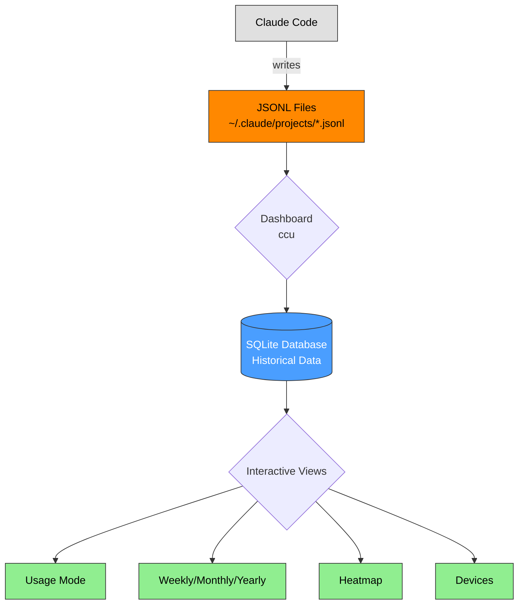

# Claude Code Goblin (Modified Fork)


> [!IMPORTANT]
> This is a **modified fork** of [claude-goblin](https://github.com/data-goblin/claude-goblin) with multi-PC support and streamlined functionality.
>
> **Installation**: Run from source (see [Installation](#installation)) - `pip install claude-goblin` installs the original, not this fork.

**Interactive TUI dashboard for Claude Code usage analytics and long-term tracking.**

Most features are accessed through keyboard shortcuts in the interactive dashboard - minimal command-line interface by design.

---

## Quick Start

```bash
# Install pipx (if not already installed)
sudo apt install pipx       # Ubuntu/Debian
brew install pipx           # macOS

# Configure PATH
pipx ensurepath
source ~/.bashrc

# Clone and install
git clone https://github.com/wangtae/claude-goblin-mod.git
cd claude-goblin-mod
pipx install -e .

# Run from anywhere
ccu
```

That's it! The interactive dashboard will open with all your Claude Code usage data.

---

## Features

### Core Functionality

- 📊 **Interactive Dashboard** - All features accessible via keyboard shortcuts (no complex CLI commands)
- 🔄 **Real-time Updates** - Automatic file watching when Claude Code creates new logs
- 📅 **Long-term Tracking** - Preserves usage data beyond Claude Code's 30-day limit
- 🌐 **Multi-PC Sync** - Automatic OneDrive/iCloud Drive detection for seamless multi-computer tracking
- 🖥️ **Per-Machine Stats** - Track usage breakdown across different computers

### View Modes (All In-Dashboard)

Access via keyboard shortcuts - no separate commands needed:

- **Usage Mode** (`u`) - Current week limits with reset times and cost estimates
- **Weekly View** (`w`) - Daily breakdown with hourly drill-down
- **Monthly View** (`m`) - Project and daily statistics for current month
- **Yearly View** (`y`) - Annual overview with monthly/project breakdowns
- **Heatmap** (`h`) - GitHub-style activity visualization
- **Devices** (`d`) - Per-machine usage statistics

### This Fork's Enhancements

- ✅ **Automatic OneDrive/iCloud Detection** - Zero-config multi-PC sync
- ✅ **Timezone Support** - Auto-detect system timezone with configurable settings
- ✅ **Streamlined Codebase** - Removed unused features (hooks, status bar, export)
- ✅ **Configuration Management** - Simple config system for database path and machine names
- ✅ **Project Anonymization** - `--anon` flag for sharing screenshots safely

---

## Screenshots

> [!NOTE]
> Screenshots will be added once the project reaches v1.0

### Dashboard Overview
<!-- TODO: Add screenshot of main dashboard -->
The main interactive dashboard showing current usage statistics and navigation hints.

### Usage Mode
<!-- TODO: Add screenshot of usage mode -->
Real-time usage limits with session, weekly, and Opus percentages.

### Weekly View
<!-- TODO: Add screenshot of weekly view -->
Daily breakdown with drill-down to hourly statistics (press `1-7` for specific days).

### Heatmap View
<!-- TODO: Add screenshot of heatmap mode -->
GitHub-style activity heatmap showing usage patterns throughout the year.

### Devices View
<!-- TODO: Add screenshot of devices mode -->
Per-machine statistics when using multi-PC synchronization.

---

## Installation

> [!IMPORTANT]
> This fork is installed from source, not PyPI. `pip install claude-goblin` installs the **original** version, not this fork!

### Recommended: Global Install with pipx

Install once with `pipx`, then use `ccu` from anywhere (no virtual environment needed):

```bash
# Install pipx (if not already installed)
sudo apt install pipx       # Ubuntu/Debian
brew install pipx           # macOS
pip install --user pipx     # Other systems

# Configure PATH
pipx ensurepath
source ~/.bashrc  # or restart terminal

# Clone and install
git clone https://github.com/wangtae/claude-goblin-mod.git
cd claude-goblin-mod
pipx install -e .

# Now you can use ccu anywhere
ccu  # Works from any directory!
```

**Why pipx?**
- ✅ **Isolated environment** - No dependency conflicts with other Python packages
- ✅ **Global access** - Use `ccu` from any directory without activating virtual environments
- ✅ **Editable mode** - Source code changes are immediately reflected (perfect for development)
- ✅ **Clean uninstall** - `pipx uninstall claude-goblin-mod` removes everything
- ✅ **Recommended by Python packaging community** for CLI tools

### Alternative: Local Editable Install (pip)

For systems where pipx is not available or if you prefer pip:

```bash
# Clone the repository
git clone https://github.com/wangtae/claude-goblin-mod.git
cd claude-goblin-mod

# Install in editable mode (creates ccu command)
pip install -e .

# Now you can use ccu anywhere
ccu  # Works from any directory!
```

**Note**: On some systems (Ubuntu 24.04+), you may encounter an "externally-managed-environment" error. In this case, use pipx instead (recommended) or create a virtual environment (see next section).

**If `ccu: command not found`**, add `~/.local/bin` to your PATH:
```bash
# Add to ~/.bashrc or ~/.zshrc
export PATH="$HOME/.local/bin:$PATH"
source ~/.bashrc
```

### Alternative: Virtual Environment

For completely isolated installation:

```bash
git clone https://github.com/wangtae/claude-goblin-mod.git
cd claude-goblin-mod

# Create and activate virtual environment
python3 -m venv venv
source venv/bin/activate  # Windows: venv\Scripts\activate

# Install in editable mode
pip install -e .

# Use (while venv is active)
ccu
```

### Alternative: Run from Source (No Install)

For quick testing without installation:

```bash
git clone https://github.com/wangtae/claude-goblin-mod.git
cd claude-goblin-mod

# Install dependencies only
pip install -r requirements.txt

# Run directly
python3 -m src.cli
```

---

## Usage

### Starting the Dashboard

```bash
ccu                          # Standard mode with file watching
ccu --refresh=30             # Refresh every 30 seconds instead
ccu --anon                   # Anonymize project names (for screenshots)
ccu --watch-interval=30      # File watch check interval
ccu --limits-interval=120    # Usage limits update interval
```

### Keyboard Shortcuts (In Dashboard)

**View Modes:**
- `u` - Usage mode (current limits and costs)
- `w` - Weekly view
- `m` - Monthly view
- `y` - Yearly view
- `h` - Heatmap view
- `d` - Devices view (multi-PC stats)

**Navigation:**
- `1-7` - Hourly drill-down for specific day (weekly mode)
- `<` / `>` - Previous/next period (weekly/monthly/yearly)
- `tab` - Change display mode/color scheme
- `r` - Manual refresh
- `s` - Settings menu
- `q` / `Esc` - Quit

**Everything is accessible via these keyboard shortcuts - no need to learn complex commands!**

### Additional Commands

Only a few commands exist outside the dashboard:

```bash
# Heatmap in terminal (also accessible via 'h' in dashboard)
ccu heatmap              # Current year
ccu heatmap --year 2024  # Specific year

# Configuration (rarely needed, OneDrive auto-detected)
ccu config show                              # View config
ccu config set-db-path <path>                # Set custom DB path
ccu config set-machine-name "Home-Desktop"   # Set friendly name

# Database management (rarely needed)
ccu reset-db --force     # Reset database
```

Most users will only ever run `ccu` to open the dashboard.

---

## How It Works



**Key Points:**
- **JSONL files** - Claude Code's raw logs (30-day rolling window)
- **Dashboard** - Reads JSONL and saves to SQLite (automatic deduplication)
- **Database** - Single source of truth, preserves data indefinitely
- **Interactive views** - All accessed via keyboard shortcuts in one dashboard

### Data Sources

| File | Location | Purpose |
|------|----------|---------|
| **JSONL logs** | `~/.claude/projects/*.jsonl` | Current 30-day usage from Claude Code |
| **SQLite DB** | `~/.claude/usage/usage_history.db` | Historical data (default location) |
| **SQLite DB** | `/mnt/d/OneDrive/.claude-goblin/usage_history.db` | OneDrive sync (auto-detected) |
| **Config** | `~/.claude/goblin_config.json` | User configuration |

---

## Multi-PC Synchronization

This fork automatically detects OneDrive and iCloud Drive for seamless multi-PC tracking.

### Zero-Configuration Setup

```bash
# On PC-A (Desktop)
ccu
# → Auto-detects: /mnt/d/OneDrive/.claude-goblin/usage_history.db
# → OneDrive syncs to cloud automatically

# On PC-B (Laptop)
ccu
# → Auto-detects same OneDrive database
# ✅ Combined usage from both PCs!
```

### Database Location Priority

1. Config file setting (if manually set via `ccu config set-db-path`)
2. Environment variable `CLAUDE_GOBLIN_DB_PATH`
3. OneDrive auto-detection (WSL2: `/mnt/*/OneDrive/.claude-goblin/`)
4. iCloud Drive auto-detection (macOS: `~/Library/Mobile Documents/com~apple~CloudDocs/.claude-goblin/`)
5. Local fallback (`~/.claude/usage/`)

### Supported Cloud Storage

- ✅ **OneDrive** (Windows/WSL2) - Auto-detected on drives C:, D:, E:, F:
- ✅ **iCloud Drive** (macOS) - Auto-detected automatically
- ⚙️ **Custom paths** - Any path via `ccu config set-db-path <path>`

### Deduplication

SQLite UNIQUE constraint on `(session_id, message_uuid)` prevents duplicates - multiple PCs can safely write to the same database.

---

## What It Tracks

- **Tokens** - Input, output, cache creation, cache read (by model and project)
- **Models** - Claude Sonnet, Opus, Haiku usage breakdown
- **Projects** - Folders/directories where you've used Claude Code
- **Sessions** - Unique conversation threads
- **Time Patterns** - Hourly, daily, monthly, yearly activity
- **Usage Limits** - Real-time session, weekly, and Opus limits with background updates
- **Devices** - Per-machine statistics (machine name, tokens, cost, date range)
- **Cost Estimates** - Calculate equivalent API costs vs Claude Pro subscription

High "Cache Read" percentages (80-90%+) indicate efficient context reuse, which speeds up responses and reduces costs.

---

## Technical Implementation

### Real-time Updates

**File Watching (Default)**
- Uses `watchdog` library to monitor `~/.claude/projects/*.jsonl`
- Updates dashboard automatically when Claude Code creates/modifies logs
- More efficient than polling

**Periodic Refresh** (`--refresh=N`)
- Updates every N seconds via polling
- Fallback for environments where file watching doesn't work

### Background Threads

- **Limits updater** - Fetches usage limits every 60 seconds (configurable)
- **Keyboard listener** - Non-blocking input handling for instant mode switching
- **File watcher** - Monitors JSONL files for changes

### Timezone Handling

Claude Code stores timestamps in **UTC**. This tool converts to your **local timezone** automatically:
- Auto-detect from `/etc/timezone` (Linux/WSL)
- Configurable in settings menu (press `s` in dashboard)
- Support for 'auto' mode, UTC, and IANA timezones

### Weekly Date Filtering

Parses Claude's `/usage` reset dates (e.g., "Oct 17, 10am (Asia/Seoul)") and filters data to match the current 7-day limit period shown in Claude Code.

---

## Requirements

- **Python** >= 3.10
- **Claude Code** (for generating usage data)
- **Dependencies:**
  - `rich` >= 13.7.0 - Terminal UI framework
  - `typer` >= 0.9.0 - CLI framework
  - `watchdog` >= 3.0.0 - File system monitoring

---

## Troubleshooting

### "No Claude Code data found"
- Ensure Claude Code is installed and you've used it at least once
- Check that `~/.claude/projects/` exists and contains `.jsonl` files

### Limits showing "Could not parse usage data"
- Run `claude` in a trusted folder first
- Claude needs folder trust to display `/usage` data

### Database errors
```bash
ccu reset-db --force  # Reset database
ccu                   # Rebuild from current data
```

### Multi-PC sync not working
```bash
ccu config show  # Check detected database path
ccu config set-db-path /path/to/OneDrive/.claude-goblin/usage_history.db
```

---

## Project Anonymization

Perfect for sharing screenshots publicly:

```bash
ccu --anon         # Anonymize in dashboard
ccu heatmap --anon # Anonymize in heatmap
```

Projects are renamed to `project-001`, `project-002`, etc., ranked by total token usage (highest usage = project-001).

---

## License

MIT License - see [LICENSE](LICENSE) file for details

---

## Contributing

Contributions welcome!

1. Fork the repository
2. Create a feature branch
3. Submit a pull request

---

## Credits

**Original Project:** [claude-goblin](https://github.com/data-goblin/claude-goblin) by Kurt Buhler

**Built with:**
- [Rich](https://github.com/Textualize/rich) - Terminal UI framework
- [Typer](https://github.com/tiangolo/typer) - CLI framework
- [Watchdog](https://github.com/gorakhargosh/watchdog) - File system monitoring

---

**AI Tools Disclaimer:** This project was developed with assistance from Claude Code.
