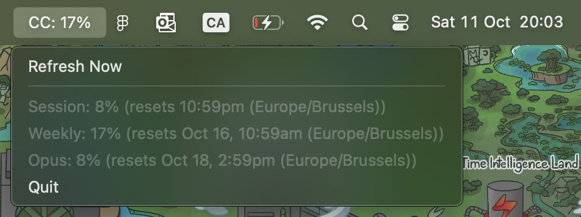
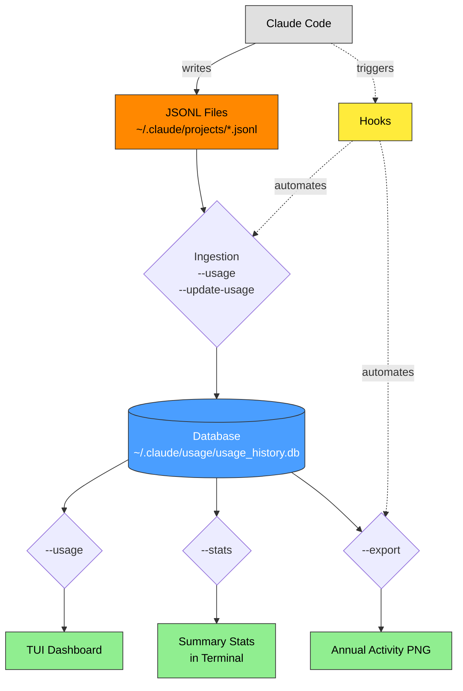

# Claude Goblin


Python command line tool to help with Claude Code utilities and usage tracking/analytics.

**Quick Start:** Install with `pip install claude-goblin` and use `claude-goblin --help` for commands or `claude-goblin usage` to start tracking. Below are some examples of outputs that this command line can give you.

---

**TUI Dashboard:**


---

**MacOS status bar for usage limits:**



---

**GitHub activity-style heatmap of annual usage:**


--- 


> [!NOTE] 
> This tool was developed and tested on macOS (Python 3.13). Should work on Linux and Windows but is untested on those platforms.


## Features

- Local snapshotting of Claude Code logs for analytics
- Local snapshotting of usage limits from the Claude Code `/usage` command
- Dashboard and stats of usage and limit history
- Hook setup to automate data logging or analysis of Claude Code
- Audio notifications for Claude Code completion and permission requests

## Installation

### From PyPI (recommended)
```bash
# Install from PyPI
pip install claude-goblin

# Optional: Install export dependencies for PNG/SVG generation
pip install "claude-goblin[export]"
```

### From source
```bash
# Clone the repository
git clone https://github.com/data-goblin/claude-goblin.git
cd claude-goblin

# Install with pip
pip install -e .

# Optional: Install export dependencies
pip install -e ".[export]"
```

## First-Time Setup

After installation, start tracking your Claude Code usage:

```bash
# View your current usage dashboard
claude-goblin usage

# (Optional) Enable automatic tracking with hooks
claude-goblin setup-hooks usage
```

**Note**: The `usage` command automatically saves your data to the historical database every time you run it. No manual setup required.

### Commands Explained

- **`update-usage`**: Update historical database with latest data and fill in missing date gaps with empty records (use when you want continuous date coverage for the heatmap)

For most users, just run `usage` regularly and it will handle data tracking automatically. Use `setup-hooks usage` to automate this completely.

## Commands

| Command | Description |
|---------|-------------|
| **Dashboard & Analytics** | |
| `claude-goblin usage` | Show usage dashboard with KPI cards and breakdowns |
| `claude-goblin usage --live` | Auto-refresh dashboard every 5 seconds |
| `claude-goblin usage --fast` | Skip live limits for faster rendering |
| `claude-goblin limits` | Show current usage limits (session, week, Opus) |
| `claude-goblin stats` | Show detailed statistics and cost analysis |
| `claude-goblin status-bar [type]` | Launch macOS menu bar app (session\|weekly\|opus) |
| **Export** | |
| `claude-goblin export` | Export yearly heatmap as PNG (default) |
| `claude-goblin export --svg` | Export as SVG image |
| `claude-goblin export --open` | Export and open the image |
| `claude-goblin export -y 2024` | Export specific year |
| `claude-goblin export -o output.png` | Specify output file path |
| **Data Management** | |
| `claude-goblin update-usage` | Update historical database with latest data |
| `claude-goblin delete-usage --force` | Delete historical database (requires --force) |
| `claude-goblin restore-backup` | Restore from backup |
| **Hooks (Advanced)** | |
| `claude-goblin setup-hooks usage` | Auto-track usage after each Claude response |
| `claude-goblin setup-hooks audio` | Play sounds for completion & permission requests |
| `claude-goblin setup-hooks png` | Auto-generate PNG after each response |
| `claude-goblin remove-hooks [type]` | Remove hooks (usage\|audio\|png, or all) |

## Data Source

Claude Goblin reads usage data from Claude Code's local session logs:
```
~/.claude/projects/*.jsonl
```

**Important**: Claude Code retains session logs for approximately **30 days** (rolling window). There is no way to get other historical data without contacting Anthropic support. Claude Goblin solves this by:
- Automatically saving data to an SQLite database (`~/.claude/usage/usage_history.db`) whenever you run `--usage`
- Preserving historical data indefinitely
- Merging current + historical data for complete analytics
- Configuration to choose between saving detailed or aggregate data

## How It Works



**Key Points:**
- **JSONL files** are raw logs with a 30-day rolling window (older data disappears)
- **Ingestion** step reads JSONL and saves to DB (with automatic deduplication via `UNIQUE` constraint)
- **Database** is the single source of truth - all display commands read from here only
- **Hooks** can automate ingestion after each Claude response

### Command Behavior

**`claude-goblin usage`** (Display + Ingestion)
1. **Ingestion**: Reads JSONL files from `~/.claude/projects/*.jsonl` and saves to DB
2. **Display**: Reads data from DB and renders dashboard

**`claude-goblin export`** (Display only)
1. Reads data from DB at `~/.claude/usage/usage_history.db`
2. Generates yearly heatmap
3. Exports to current directory as `claude-usage-<timestamp>.png` (or specify with `-o`)

**`claude-goblin stats`** (Display + Ingestion)
1. **Ingestion**: Reads JSONL files from `~/.claude/projects/*.jsonl` and saves to DB
2. **Display**: Reads data from DB and displays comprehensive statistics

**`claude-goblin update-usage`** (Ingestion only)
1. Reads JSONL files from `~/.claude/projects/*.jsonl`
2. Saves to DB at `~/.claude/usage/usage_history.db` (with automatic deduplication)
3. Fills in missing dates with empty records (ensures continuous heatmap)

### File Locations

| File | Location | Purpose |
|------|----------|---------|
| **JSONL logs** | `~/.claude/projects/*.jsonl` | Current 30-day usage data from Claude Code |
| **SQLite DB** | `~/.claude/usage/usage_history.db` | Historical usage data preserved indefinitely |
| **Default exports** | `~/.claude/usage/claude-usage-<timestamp>.png` | PNG/SVG heatmaps (default location unless `-o` is used) |
| **Hook exports** | `~/.claude/usage/claude-usage.png` | Default location for PNG hook auto-updates |

## --usage TUI dashboard

Example TUI:


## --export Heatmap

Export a GitHub-style yearly activity heatmap:

```bash
claude-goblin export --open
```

Example heatmap:


### --export Formats

- **PNG** (default): `claude-goblin export`

## --status-bar (macOS only)

Launch a menu bar app showing your Claude Code usage limits:

```bash
# Show weekly usage (default)
claude-goblin status-bar weekly

# Show session usage
claude-goblin status-bar session

# Show Opus weekly usage
claude-goblin status-bar opus
```

The menu bar displays "CC: XX%" and clicking it shows all three limits (Session, Weekly, Opus) with reset times.

**Running in background:**
- Use `&` to run in background: `claude-goblin status-bar weekly &`
- Use `nohup` to persist after terminal closes: `nohup claude-goblin status-bar weekly > /dev/null 2>&1 &`

Example:


## Historical Data

Claude Goblin automatically saves data every time you run `usage`. To manually manage:

```bash
# View historical stats
claude-goblin stats

# Update database with latest data and fill date gaps
claude-goblin update-usage

# Delete all history
claude-goblin delete-usage -f
```

## What It Tracks

- **Tokens**: Input, output, cache creation, cache read (by model and project)
- **Prompts**: User prompts and assistant responses
- **Sessions**: Unique conversation threads
- **Models**: Which Claude models you've used (Sonnet, Opus, Haiku)
- **Projects**: Folders/directories where you've used Claude
- **Time**: Daily activity patterns throughout the year
- **Usage Limits**: Real-time session, weekly, and Opus limits

It will also compute how much you would have had to pay if you used API pricing instead of a $200 Max plan.


## Technical Details

### Timezone Handling

All timestamps in Claude Code's JSONL files seem to be stored in **UTC**. Claude Goblin should convert to your **local timezone** when grouping activity by date. This has only been tested with European CET.

### Cache Efficiency

The token breakdown shows cache efficiency. High "Cache Read" percentages (80-90%+) mean Claude Code is effectively reusing context, which:
- Speeds up responses
- Can reduce costs on usage-based plans
- Indicates good context management

## Requirements

- Python >= 3.10
- Claude Code (for generating usage data)
- Rich >= 13.7.0 (terminal UI)
- rumps >= 0.4.0 (macOS menu bar app, macOS only)
- Pillow + CairoSVG (optional, for PNG/SVG export)

## License

MIT License - see LICENSE file for details

## Contributing

Contributions welcome! Please:
1. Fork the repository
2. Create a feature branch
3. Submit a pull request

I don't have much time but I'll review PRs when I can.

## Troubleshooting

### "No Claude Code data found"
- Ensure Claude Code is installed and you've used it at least once
- Check that `~/.claude/projects/` exists and contains `.jsonl` files

### Limits showing "Could not parse usage data"
- Run `claude` in a trusted folder first
- Claude needs folder trust to display usage limits

### Export fails
- Install export dependencies: `pip install -e ".[export]"`
- For PNG: requires Pillow and CairoSVG

### Database errors
- Try deleting and recreating: `claude-goblin delete-usage --force`
- Then run: `claude-goblin usage` to rebuild from current data

## **AI Tools Disclaimer**: 
This project was developed with assistance from Claude Code.

## Credits

Built with:
- [Rich](https://github.com/Textualize/rich) - Terminal UI framework
- [Pillow](https://python-pillow.org/) - Image processing (optional)
- [CairoSVG](https://cairosvg.org/) - SVG to PNG conversion (optional)
